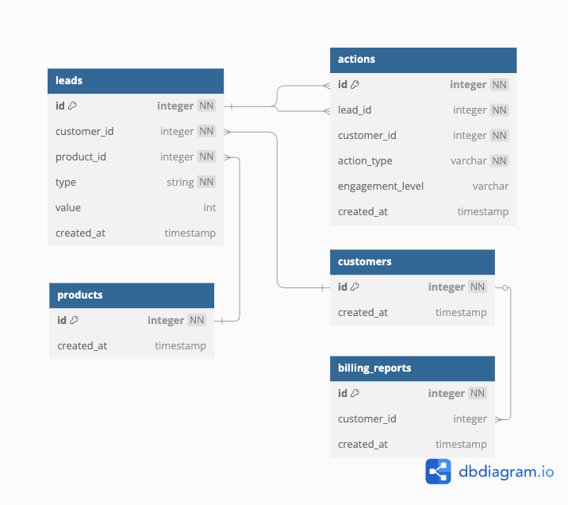

# Material Bank Leads Billing Engine

## Table of Contents

1. [Project Overview](#project-overview)
   - [Components](#components)
2. [Setup Instructions](#setup-instructions)
   - [Prerequisites](#prerequisites)
   - [Step-by-Step Guide](#step-by-step-guide)
3. [Database Schema](#database-schema)
   - [Tables](#tables)
     - [Customers](#customers)
     - [Leads](#leads)
     - [Products](#products)
     - [Actions](#actions)
     - [BillingReports](#billingreports)
     - [BillingReportFiles](#billingreportfiles)
4. [Billing Logic](#billing-logic)
5. [Error Scenarios](#error-scenarios)
6. [Scripts Usage](#scripts-usage)
   - [Seeding the Database](#seeding-the-database)
   - [Running Tests](#running-tests)
7. [Sample Billing Reports](#sample-billing-reports)
   - [Detailed Billing Breakdown](#detailed-billing-breakdown)

## Project Overview

The Leads Billing Engine processes leads based on their types and actions, assigns values accordingly, and generates detailed billing reports for customers. The project includes infrastructure provisioning, backend development, database management, and deployment automation.

### Components

1. **Infrastructure**: Provisioned using Terraform and LocalStack.
2. **Backend**: Developed using FastAPI and Python.
3. **Database**: Managed using PostgreSQL and SQLAlchemy ORM.
4. **Deployment**: Automated using Docker and Terraform scripts.

## Setup Instructions

### Prerequisites

- Docker
- Terraform

- Python 3.8+
- Poetry (for dependency management)

### Step-by-Step Guide

1. **Clone the Repository**

```sh
git clone https://github.com/your-repo/leads-billing-engine.git
cd leads-billing-engine
```

2. **Initialize Terraform**

```sh
cd terraform
terraform init
```

3. **Deploy Infrastructure**

```sh
terraform apply
```

4. **Install Python Dependencies**

```sh
cd ../backend
poetry install
```

5. **Run Database Migrations**

```sh
poetry run alembic upgrade head
```

6. **Start the Backend Service**

```sh
poetry run uvicorn app.main:app --reload
```

7. **Seed the Database (Optional)**

```sh
poetry run python scripts/seed_db.py
```

OR use the following command to run the Makefile:

```sh
make -f Makefile.mk
```

where you can run the following commands:
Setup Commands:
make setup - Set up development environment
make clean - Clean up generated files

Docker Commands:
make docker-build - Build Docker images
make docker-up - Start Docker containers
make docker-down - Stop Docker containers

Testing Commands:
make test - Run unit tests
make test-integration - Run integration tests

Database Commands:
make migrate - Run database migrations
make migrate-down - Revert last migration
make migrate-create name=migration_name - Create new migration
make seed - Seed database with sample data

Terraform Commands:
make terraform-init - Initialize Terraform
make terraform-plan - Create Terraform plan
make terraform-apply - Apply Terraform configuration
make terraform-destroy - Destroy Terraform resources

Application Commands:
make api-local - Run API locally

## Database Schema

### Tables



#### Customers

```yaml
- customer_id: UUID, Primary Key
- name: String, Not Null
- email: String, Unique, Not Null
- created_at: Timestamp
```

#### Leads

```yaml
- lead_id: UUID, Primary Key
- customer_id: UUID, Foreign Key to Customers
- lead_type: String (e.g., "Website Visit", "Social Media")
- created_at: Timestamp
```

#### Products

```yaml
- product_id: UUID, Primary Key
- name: String, Not Null
- description: Text, Optional
- created_at: Timestamp
```

#### Actions

```yaml
- action_id: UUID, Primary Key
- lead_id: UUID, Foreign Key to Leads
- action_type: String
- engagement_level: String
- cost_amount: Float
- created_at: Timestamp
```

#### BillingReports

```yaml
- report_id: UUID, Primary Key
- customer_id: UUID, Foreign Key to Customers
- total_billed_amount: Float
- total_savings: Float
- created_at: Timestamp
```

#### BillingReportFiles

```yaml
- id: UUID, Primary Key
- customer_id: UUID, Foreign Key to Customers
- file_path: String
- created_at: Timestamp
```

## Billing Logic

1. **Lead Evaluation**: Assess leads based on `lead_type` and actions.
2. **Action Valuation**: Assign monetary values to actions based on `engagement_level` (e.g., High = $10, Medium = $5, Low = $2).
3. **Billing Calculation**: Aggregate the values of actions to compute the total billing amount per lead and per customer.
4. **Business Logic**:
   - **Lead Recognition**: Differentiate between lead types and apply appropriate billing rules.
   - **Error Handling**: Manage scenarios such as invalid data, duplicate leads, missing fields, and system failures.
   - **Duplicate Lead Detection**: Ensure that duplicate leads (same user, same action type, same engagement level) are not charged multiple times and recorded as savings in the billing report.
   - **Billing Cap Implementation**: Apply a billing cap of $100 per lead user. Any charges beyond this cap should not be billed but recorded as savings in the billing report.
   - **Product Association**: Differentiate leads based on `product_id`. Leads with the same user and action types but different products should be treated as separate and billed independently.

## Error Scenarios

1. **Invalid Data**: Returns a 400 status code with a descriptive error message.
2. **Duplicate Leads**: Detects duplicates and marks them as not billed.
3. **Billing Cap**: Ensures that the total billed amount does not exceed the cap and records the excess as savings.
4. **Database Errors**: Returns a 500 status code with a descriptive error message.

## Scripts Usage

### Seeding the Database

Use the `seed_db.py` script to populate the database with sample lead data.

```sh
poetry run python scripts/seed_db.py
```

### Running Tests

Use `pytest` to run unit and integration tests.

```sh
pytest backend/tests
```

## Sample Billing Reports

### Detailed Billing Breakdown

#### B2B Partner Company: `Acme Corporation`

**End Customer Email:** `john@example.com`

| **Customer Email** | **Associated Product** | **Lead Type**  | **Action Type** | **Engagement Level** | **Amount (USD)** | **Duplicate**                       | **Status**             |
| ------------------ | ---------------------- | -------------- | --------------- | -------------------- | ---------------- | ----------------------------------- | ---------------------- |
| `john@example.com` | `Product ABC`          | Website Visit  | Form Submission | High                 | $10.00           | No                                  | Billed                 |
| `john@example.com` | `Product ABC`          | Website Visit  | Form Submission | High                 | $10.00           | Yes (Duplicate of first submission) | Not Billed (Duplicate) |
| `john@example.com` | `Product DEF`          | Social Media   | Like            | Low                  | $2.00            | No                                  | Billed                 |
| `john@example.com` | `Product DEF`          | Social Media   | Share           | Medium               | $5.00            | No                                  | Billed                 |
| `john@example.com` | `Product GHI`          | Email Campaign | Click           | High                 | $15.00           | No                                  | Billed                 |
| `john@example.com` | `Product GHI`          | Email Campaign | Click           | High                 | $15.00           | Yes (Duplicate of first click)      | Not Billed (Duplicate) |
| `john@example.com` | `Product JKL`          | Referral       | Signup          | High                 | $20.00           | No                                  | Billed                 |
| `john@example.com` | `Product JKL`          | Referral       | Signup          | High                 | $20.00           | Yes (Duplicate of first signup)     | Not Billed (Duplicate) |
| `john@example.com` | `Product MNO`          | Webinar        | Registration    | Medium               | $5.00            | No                                  | Billed                 |
| `john@example.com` | `Product PQR`          | Event          | Attendance      | Low                  | $2.00            | No                                  | Billed                 |
| `john@example.com` | `Product STU`          | Demo Request   | Submission      | High                 | $10.00           | No                                  | Billed                 |
| `john@example.com` | `Product STU`          | Demo Request   | Submission      | High                 | $10.00           | Yes (Duplicate of first submission) | Not Billed (Duplicate) |
| `john@example.com` | `Product VWX`          | Trade Show     | Visit           | Medium               | $5.00            | No                                  | Billed                 |
| `john@example.com` | `Product VWX`          | Trade Show     | Visit           | Medium               | $5.00            | Yes (Duplicate of first visit)      | Not Billed (Duplicate) |
| `john@example.com` | `Product YZA`          | Conference     | Attendance      | High                 | $15.00           | No                                  | Billed                 |
| `john@example.com` | `Product YZA`          | Conference     | Attendance      | High                 | $15.00           | Yes (Duplicate of first attendance) | Not Billed (Duplicate) |
| `john@example.com` | `Product BCD`          | Newsletter     | Click           | Medium               | $5.00            | No                                  | Billed                 |
| `john@example.com` | `Product BCD`          | Newsletter     | Click           | Medium               | $5.00            | Yes (Duplicate of first click)      | Not Billed (Duplicate) |
| `john@example.com` | `Product EFG`          | Feedback       | Submission      | High                 | $10.00           | No                                  | Billed                 |
| `john@example.com` | `Product EFG`          | Feedback       | Submission      | High                 | $10.00           | Yes (Duplicate of first submission) | Not Billed (Duplicate) |

**Subtotal for `Product ABC`:** $10.00  
**Subtotal for `Product DEF`:** $7.00  
**Subtotal for `Product GHI`:** $15.00  
**Subtotal for `Product JKL`:** $20.00  
**Subtotal for `Product MNO`:** $5.00  
**Subtotal for `Product PQR`:** $2.00  
**Subtotal for `Product STU`:** $10.00  
**Subtotal for `Product VWX`:** $5.00  
**Subtotal for `Product YZA`:** $15.00  
**Subtotal for `Product BCD`:** $5.00  
**Subtotal for `Product EFG`:** $10.00

**Total Billed Amount:** $100.00  
**Total Savings from Duplicates and Caps:** $50.00

_Explanation: Duplicate actions have been detected and not billed again, resulting in significant savings. The total billed amount has reached the cap of $100.00._
